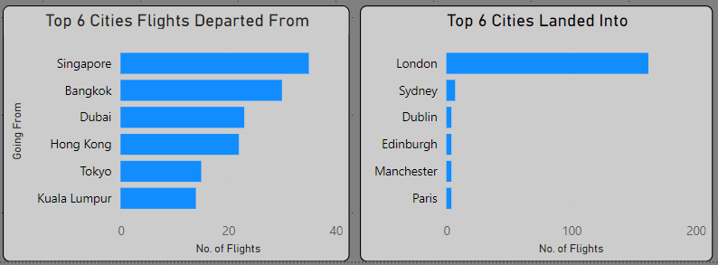

# Airline Reviews & Satisfaction Dashboard

### Problem Statement

The Airlines Reviews and Ratings dataset is a comprehensive collection of passenger feedback on various aspects of their flight experiences with different airlines. It provides insights into passenger satisfaction and service quality, offering valuable data for analysis in the travel and hospitality industry, improving customer service, and predicting customer satisfaction. This dataset is designed to explore the many facets of air travel experiences globally, including data on aircraft types, user reviews, and detailed service ratings, providing a unique perspective for analysing and predicting airline performance from the passenger's viewpoint.

[Airline Dashboard Linked Here](https://app.powerbi.com/view?r=eyJrIjoiMGM2MWRiYzctNzMxOC00Njk5LTg4NmQtZWM4ODQwM2E3ZjNjIiwidCI6IjAzNzUxNDY2LTM4YzItNDFmYi1iOTgwLTFhMjE2Zjc5YjU0MyJ9)

### Steps Followed

Step 1: Converted the CSV file to XLSX.
  -  Cleaned the data by creating headers for clarity.
  -  Removed the 'Route' column due to inaccuracies, such as row 19 in the initial dataset where the country was listed as Ireland, but the passenger was going to London.
  -  Split the 'Route' into two cells to identify the departure and arrival locations.
  -  Added a column to specify whether the route was direct or indirect, including details of any transit routes.
  -  Changed 'Seat Type' to 'Type of Traveller'.
  -  Added two columns: 'Departing Continent' and 'Landing Continent'.
  -  Marked 'Unknown' for missing route information.

 Step 2: Imported the CSV file into Power BI Desktop.
  -  Capitalised necessary column headers.
  -  Duplicated the 'Dates Flown' column three times, extracting the month, year, and quarter of the flight.
  -  Renamed the columns accordingly.
  -  Added 'Not answered' to the 'Recommended' column where it had been left blank.
  -  Open Power Query Editor: Removed irrelevant columns.
  -   Rename Columns: Adjusted column names for clarity.
  -   Data Cleaning: Replaced values and added necessary columns.

Step 3: Visualisation
 
  To optimise the space on the Overview page, I created three cards displaying:
  
  (a) Total Number of Passengers who left a review
  
  (b) Average Flights per Year
  
  (c) Average Flights per Month
  
For (b) and (c), I developed a new measure to facilitate the creation of these cards.

To calculate the average overall rating for each service in the dataset, I initially imported a star ratings visual, which did not integrate well with the dataset. Therefore, I used a card visual and modified it to display stars, grouping all the ratings together. To compute the average, I created a DAX function for all relevant ratings. An example is as follows:

### DAX Function for Average Inflight Entertainment Star Rating:
```DAX
Average of Inflight Entertainment star rating = 

VAR __MAX_NUMBER_OF_STARS = 5
VAR __MIN_RATED_VALUE = 0
VAR __MAX_RATED_VALUE = 5
VAR __BASE_VALUE = AVERAGE('Airlines Reviews and Rating 6 - (2)'[Inflight Entertainment])
VAR __NORMALIZED_BASE_VALUE =
    MIN(
        MAX(
            DIVIDE(
                __BASE_VALUE - __MIN_RATED_VALUE,
                __MAX_RATED_VALUE - __MIN_RATED_VALUE
            ),
            0
        ),
        1
    )
VAR __STAR_RATING = ROUND(__NORMALIZED_BASE_VALUE * __MAX_NUMBER_OF_STARS, 0)
RETURN
    IF(
        NOT ISBLANK(__BASE_VALUE),
        REPT(UNICHAR(9733), __STAR_RATING)
            & REPT(UNICHAR(9734), __MAX_NUMBER_OF_STARS - __STAR_RATING)
    )
```

This function normalises the average rating value and converts it into a star rating format, displaying filled stars (★) and unfilled stars (☆) based on the average rating.

Once I was satisfied with that, I added a donut chart to illustrate the percentage of passengers that would recommend the flight they were on.  Below is a snippet of this:


I also added eight blank buttons on the overview page, each representing a different page, and ensured they were linked to the correct continental pages. Additionally, I added back and forward buttons to each page to enhance the navigation and suit the end user's preferences.

I aimed to provide detailed information on where passengers from each continent were flying from. Initially, I wanted to highlight the top 10 departure cities, but this resulted in an overcrowded stacked chart. I decided it would be more effective to highlight the top 6 cities passengers were travelling to and from. To achieve this, I created measures for 'CountryRank' and 'FlightsPerCountry,' which allowed me to craft the following DAX query.

```DAX
Top10FlightsPerCountry = 
    IF(
        [CountryRank] <= 6, 
        [FlightsPerCountry], 
        BLANK()
    )
```




### Recommendations
